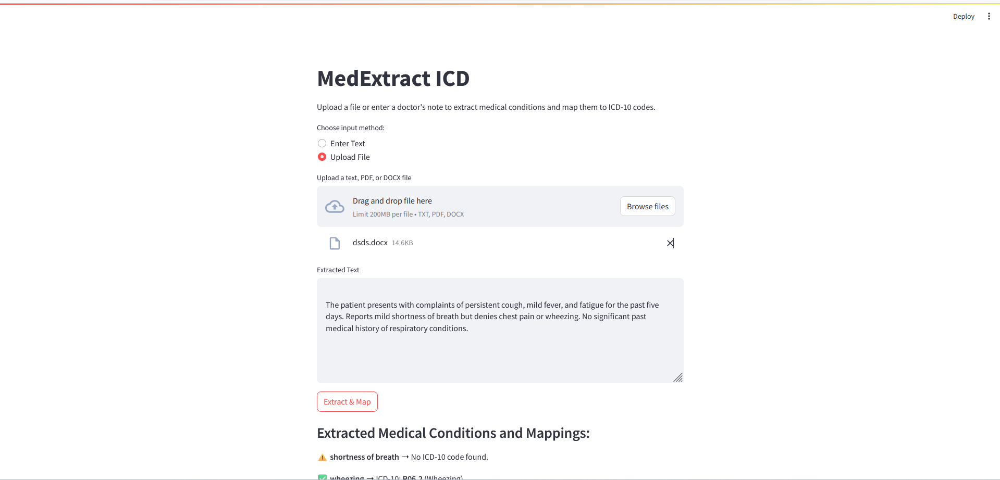
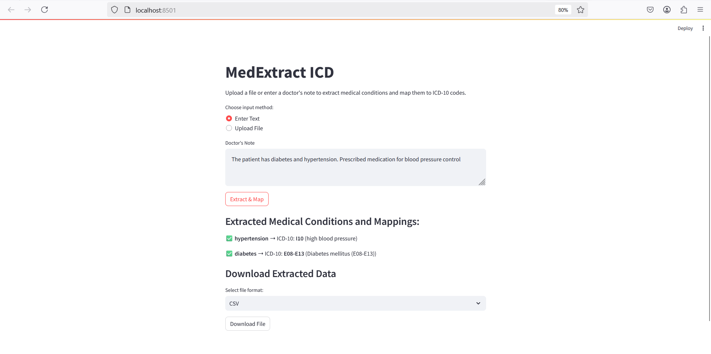
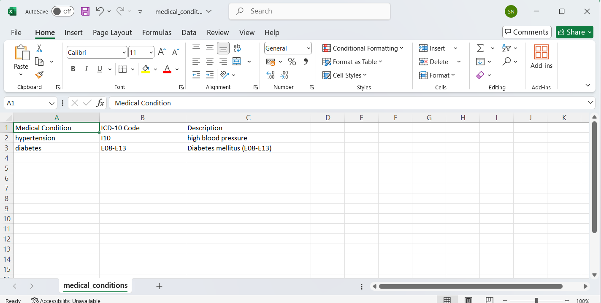
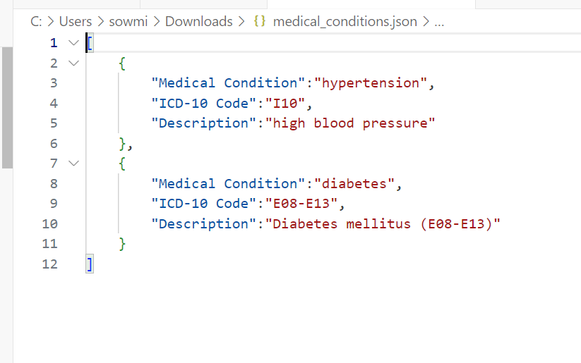
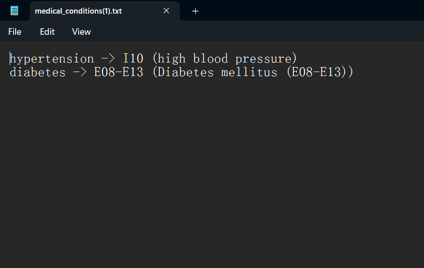

# MEDEXTRACT ICD: NLP-POWERED MEDICAL CONDITION EXTRACTION & ICD-10 MAPPING

# About
MedExtract ICD is an NLP-powered tool that automates medical coding by extracting conditions from clinical text and mapping them to ICD-10 codes. Using the en_ner_bc5cdr_md model and UMLS APIs, it ensures accurate mapping while reducing manual errors and speeding up the coding process. With a Streamlit-based interface, users can upload documents in TXT, PDF, or DOCX formats for efficient processing. This tool benefits healthcare professionals, coders, insurers, and researchers by improving coding accuracy, compliance, and operational efficiency. Future enhancements may include multi-language support and EHR integration.
# Feature

**Automated Medical Condition Extraction:** Leverages the en_ner_bc5cdr_md NLP model to automatically identify diseases and disorders from clinical text, reducing manual coding effort.

**ICD-10 Mapping:** Uses the UMLS API to map extracted medical conditions to corresponding ICD-10 codes in real-time, ensuring accurate and standardized medical coding.

**Multiple File Format Support:** Supports the processing of clinical text in various formats (TXT, PDF, DOCX), enabling flexibility for users.

**User-Friendly Interface:** Built with Streamlit, providing an intuitive and interactive interface for healthcare professionals, medical coders, and researchers to easily input or upload documents for processing.

**Real-Time Processing:** Automatically processes clinical data and provides real-time ICD-10 code mapping, eliminating the need for manual lookup and interpretation.
# Reuirements
## Hardware Rewuirements
* Processor	: Pentium Dual Core 2.00GH
* Hard disk	: 120 GB
* RAM	    : 2GB (minimum)
* Keyboard	: 110 keys enhanced

## Software Requirements
* Operating system	: Windows7 (with service pack 1), 8, 8.1 ,10 and 11
* Language		    : Python
* PyCharm (Latest Version) , Visual Studio Code 

# Flow Diagram

# System Architecture

# Output
### System Interface

### File Input

### Textual Input

### Downloadable Formats

# System Testing
### Application Error Handling

### Unit Testing

# Result
MedExtract ICD effectively automates the process of medical condition extraction and ICD-10 mapping, improving accuracy and efficiency in medical coding. By leveraging advanced NLP models and the UMLS API, it ensures precise and standardized coding from clinical text in various formats. The tool reduces manual effort, minimizes errors, and accelerates documentation and claim processing workflows. Future enhancements could include multi-language support, integration with Electronic Health Records (EHRs), and machine learning improvements for better performance and adaptability in diverse healthcare settings.
# Reference

[1]	N. Liu, Q. Hu, H. Xu, X. Xu and M. Chen, "Med-BERT: A Pretraining Framework for Medical Records Named Entity Recognition," in IEEE Transactions on Industrial Informatics, vol. 18, no. 8, pp. 5600-5608, Aug. 2022.

[2]	P. Philipp, J. Veloso, A. Appenzeller, T. Hartz and J. Beyerer, "Evaluation of an Automated Mapping from ICD-10 to SNOMED CT," 2022 International Conference on Computational Science and Computational Intelligence (CSCI), Las Vegas, NV, USA, 2022

[3]	A. Muslim, A. B. Mutiara, A. Suhendra and T. Oswari, "Expert Mapping Development System with Disease Searching Sympthom Based on ICD 10," 2018 Third International Conference on Informatics and Computing (ICIC), Palembang, Indonesia, 2018.

[4]	M. S. Ullah Miah, J. Sulaiman, T. B. Sarwar, S. S. Islam, M. Rahman and M. S. Haque, "Medical Named Entity Recognition (MedNER): A Deep Learning Model for Recognizing Medical Entities (Drug, Disease) from Scientific Texts," IEEE EUROCON 2023 - 20th International Conference on Smart Technologies, Torino, Italy, 2023.

[5]	D. Sasikala, R. Sudarshan and S. Sivasathya, "Harnessing LLMs for Medical Insights:NER Extraction from Summarized Medical Text," 2024 15th International Conference on Computing Communication and Networking Technologies (ICCCNT), Kamand, India, 2024.

[6]	B. Zhou, G. Yang, Z. Shi and S. Ma, "Natural Language Processing for Smart Healthcare," in IEEE Reviews in Biomedical Engineering, vol. 17, pp. 4-18, 2024.

[7]	G. K. Thakur, A. Thakur, N. Khan and H. Anush, "The Role of Natural Language Processing in Medical Data Analysis and Healthcare Automation," 2024 International Conference on Knowledge Engineering and Communication Systems (ICKECS), Chikkaballapur, India, 2024.

[8]	H. Tu, L. Han and G. Nenadic, "Extraction of Medication and Temporal Relation from Clinical Text using Neural Language Models," 2023 IEEE International Conference on Big Data (BigData), Sorrento, Italy, 2023.
